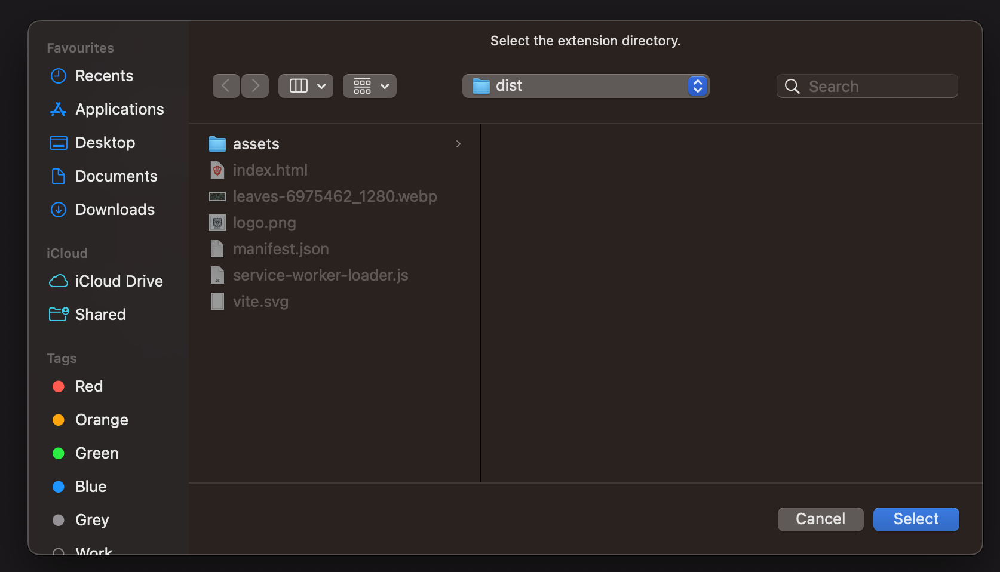
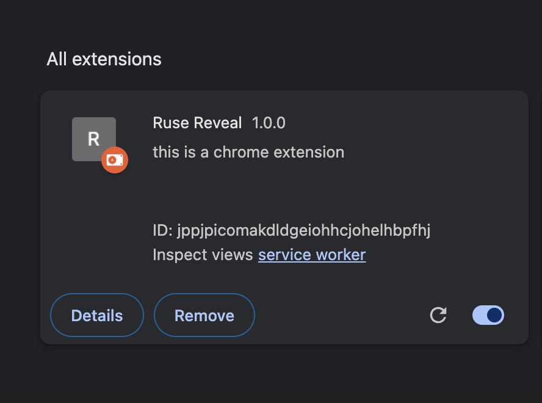
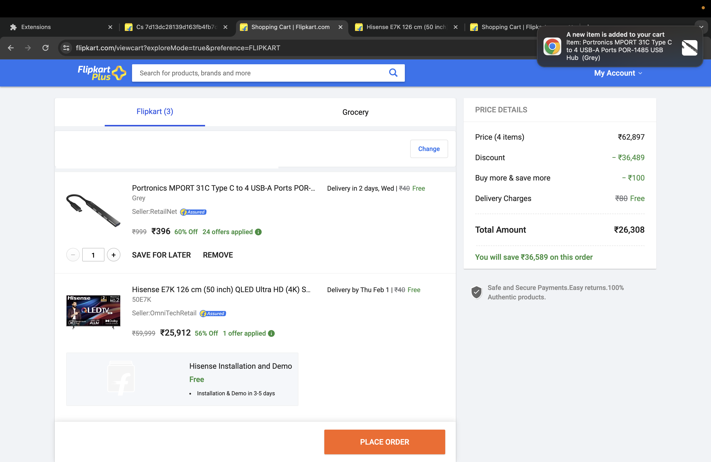
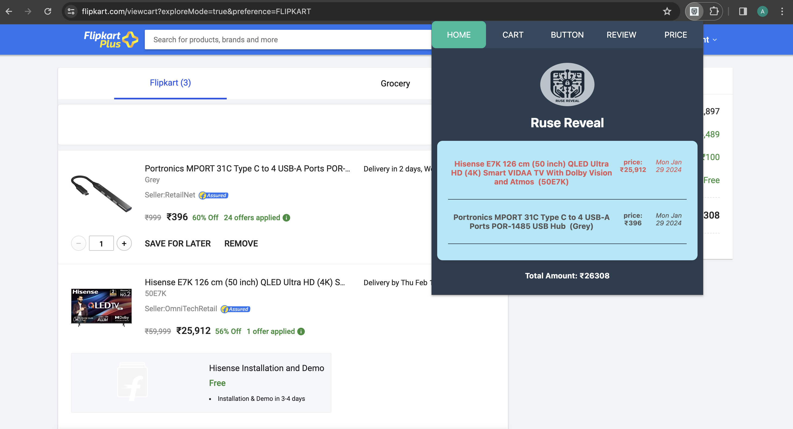
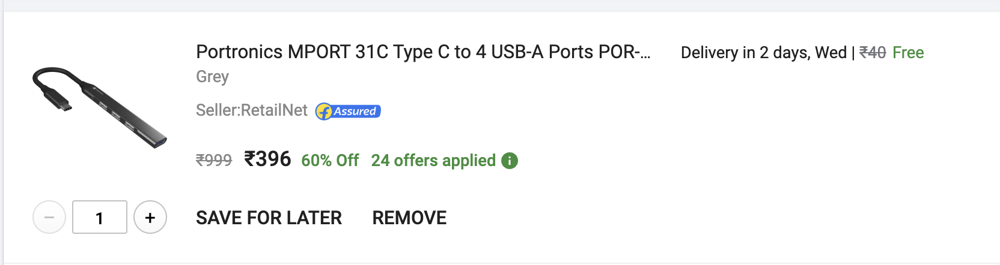
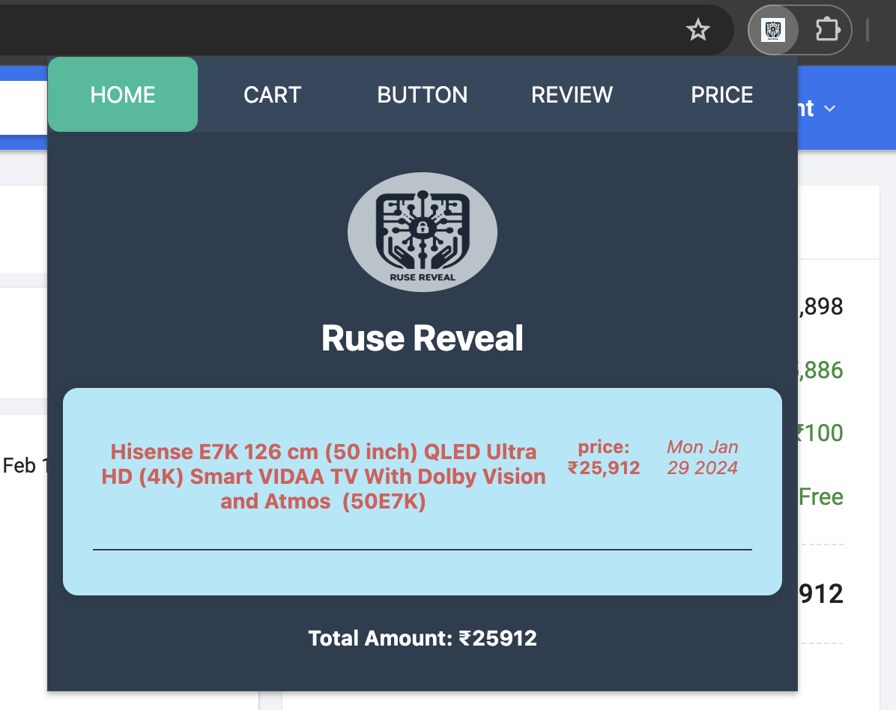
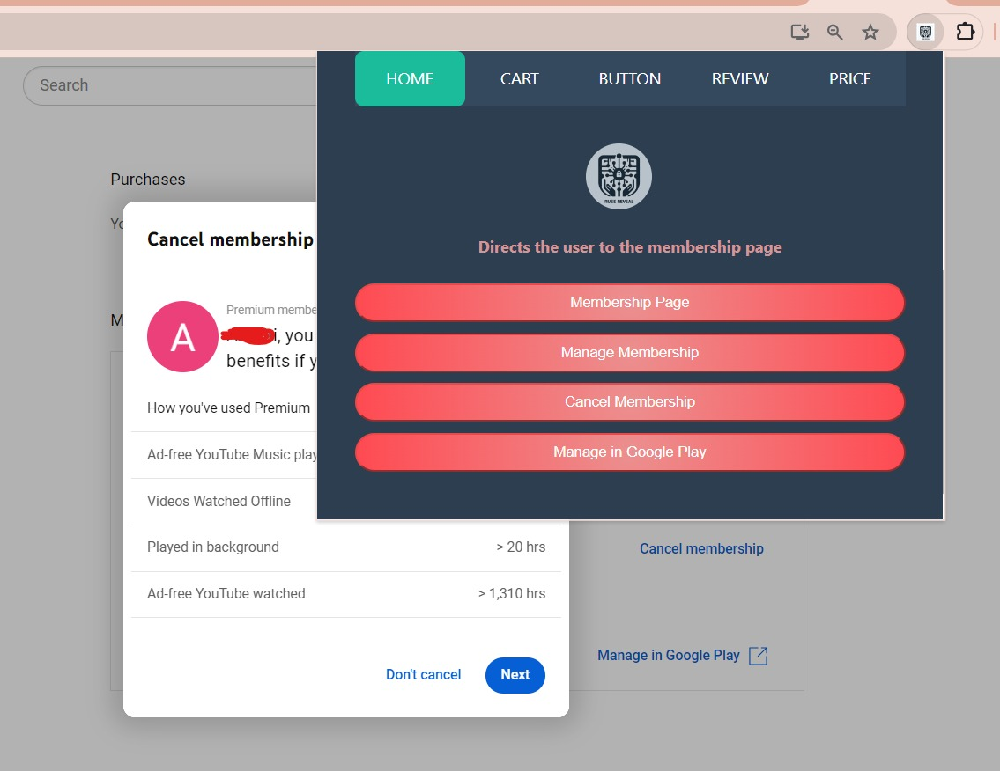
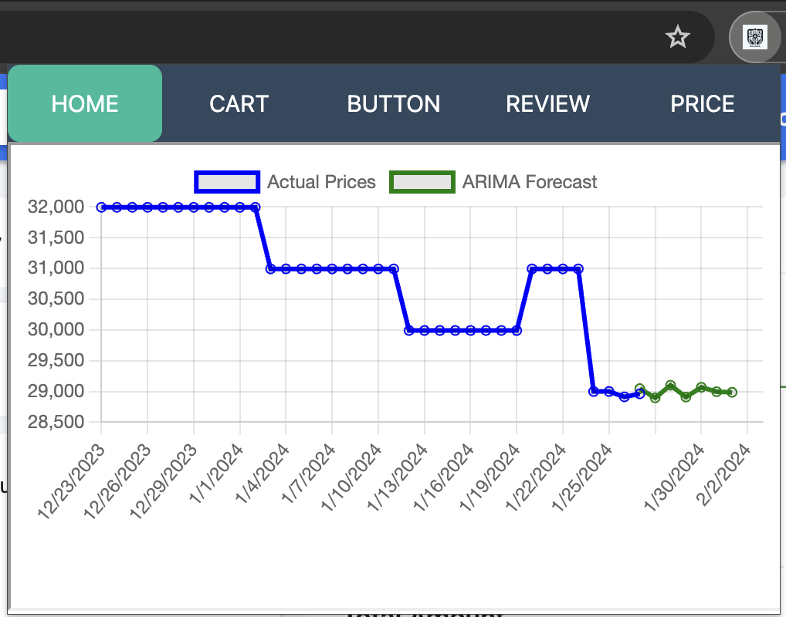

# React + ViteJS

This is an Extension that helps to detect Dark Patterns On a Ecommerce Website.

# Ruse-Reveal

## Purpose

This repository features a Browser Extension that tackles Dark Pattern on E-commerce websites.

## Installation

1. Clone the repository

```shell
git clone https://github.com/JainArchit16/Ruse-Reveal
```

2. Change your directory to Ruse-Reveal

```sh
cd Ruse-Reveal
```

3. Run the command for neccessary packages

```sh
npm install
```

4. Now build the app

```sh
npm run build
```

5. Open your browser's extension management page
6. Enable "Developer mode."
7. Click "Load unpacked" and select the "dist" folder in your extension directory.



This will load the extension on your browser



## Features

1. Sneak Into Cart
2. Button Visibility Manipulation
3. Reviews
4. Price Prediction

## Sneak Into Cart

1. Give a notification when a new item is added to cart



2. All cart items will be shown in the cart section of extension with their price, date, and the total amount of items.

3. Keep a check of all items and make it red when it is their in the cart for 7 or more days



4. When an item is removed from cart, it will also be deleted from extension UI



Item removed



## Button Visibility Manipulation

To address this issue, we have incorporated a button extension into our main model. This enables users to conveniently access membership and cancellation details on an eCommerce website through a standardized display of all buttons within the extension, facilitating seamless operation within the extension itself.



# Price Predictor using ARIMA Forecaster

## Purpose

This repository features a Price Predictor that leverages an ARIMA (AutoRegressive Integrated Moving Average) model to forecast product prices based on their price history over the past month. The primary goal is to provide users with insights into short-term fluctuations in product prices, aiding them in making informed decisions about the best time to make a purchase.

The product for the current forecast can be found [here](https://www.flipkart.com/lg-ur7500-108-cm-43-inch-ultra-hd-4k-led-smart-webos-tv-2023-a5-ai-processor-4k-gen6-60hz-refresh-rate-magic-remote-capability/p/itm926f6b65c136b?pid=TVSGQQDYSCFGRX2F&lid=LSTTVSGQQDYSCFGRX2FVATNAW&fm=neo%2Fmerchandising&iid=M_f14f9138-3f49-4442-9825-2e80b67ca013_27.GO45SKVBQD2H&ppt=hp&ppn=homepage&ssid=ucylcxqj1c0000001706348119148&otracker=clp_omu_Televisions_3_27.dealCard.OMU_tvs-and-appliances-new-clp-store_tvs-and-appliances-new-clp-store_GO45SKVBQD2H_25&otracker1=clp_omu_PINNED_neo%2Fmerchandising_Televisions_NA_dealCard_cc_3_NA_view-all_25&cid=GO45SKVBQD2H)

## Explanation of ARIMA

The model uses a standard ARIMA approach to capture short-term trends in product pricing. ARIMA combines autoregression (AR), differencing (I), and moving averages (MA) to create a robust forecasting tool. The result is a predictive model that can anticipate product prices for the next 7 days.

## Repository Structure

The repository is organized with three main components:

### server.js

This file is responsible for executing both script.py and script.js. Upon successful execution of script.py, a JSON file (arima_results.json) is generated. This file is then utilized by script.js to plot the price chart on the webpage using Charts.js.

### script.py

This Python script, upon successful build, creates the arima_results.json file, containing the predicted prices for the upcoming week.

### script.js

This JavaScript file is responsible for rendering the price chart on the webpage. Users can customize the chart's appearance and behavior by modifying this file.

## Deployment

The deployed code can be found [here](https://price-predictor-k0u3.onrender.com/)

Feel free to explore the provided deployment link to see the Price Predictor in action and visualize the predicted product prices.

## Getting Started

To run the Price Predictor locally, follow these steps:

1. Clone the repository to your local machine.
2. Install any necessary dependencies.
3. Execute server.js to initiate the prediction process.
4. Make sure to refer to the documentation for further details on how to set up and customize the Price Predictor according to your requirements.

**Note**: To use this forecaster with any other CSV file, update the data source in script.js (line 10) and script.py (line 7) to match the new dataset.

Happy forecasting!

## Price Prediction




Certainly! It seems like you want to make some improvements to your GitHub repository's README and also explain a specific feature related to managing reviews on the blockchain. Below is a revised version for your README:

---


# BlockChain Review Manager

Welcome to the BlockChain Review Manager ! This project provides a decentralized solution for managing and storing reviews securely on the blockchain. You can explore the deployed BlockChain API's on Web 2.0 in action and visualize the reviews being managed on Web3.

## Repository Structure

- **Contract:** The blockchain contract code is available in the directory [LINK](https://github.com/JainArchit16/Ruse-Reveal/blob/main/Block3/contracts/Lock.sol). It defines the structure and logic for storing reviews on the blockchain.

- **Compile.js:** This script is used to compile the blockchain contract. 

- **Deploy.js:** The deployment script is available in the [LINK](https://github.com/JainArchit16/Ruse-Reveal/blob/main/Block3/scripts/deploy.js) file. It allows you to deploy the compiled contract onto the blockchain.

## Deployment Link

Explore the deployed BlockChain API's [GITHUB REPO](https://github.com/JainArchit16/BlockChain-Rating) and [DEPLOYMENT LINK](https://rating-web3.onrender.com/) to witness the decentralized review management system in action.

## Features

One notable feature of this BlockChain Review Manager is its ability to address issues related to dark patterns on websites. Users can directly add reviews of dark patterns observed on a site to the blockchain through the provided APIs. This ensures that the reviews are securely stored on the blockchain, preventing manipulation by website owners or any other entities.

### Dark Pattern Review APIs

To facilitate the submission and retrieval of dark pattern reviews, the BlockChain Review Manager provides the following APIs:

1. **Get Reviews for a Specific Website:**
   - **API Endpoint:** [https://rating-web3.onrender.com/getReviews/{website}](https://rating-web3.onrender.com/getReviews/{website})
   - **Example Usage:** To retrieve reviews for Flipkart, use [https://rating-web3.onrender.com/getReviews/flipkart](https://rating-web3.onrender.com/getReviews/flipkart)
   - **Description:** This API returns a list of reviews submitted for a specific website, allowing users to access and analyze the feedback related to dark patterns.

2. **Get Review Count for a Specific Website:**
   - **API Endpoint:** [https://rating-web3.onrender.com/getReviewCount/{website}](https://rating-web3.onrender.com/getReviewCount/{website})
   - **Example Usage:** To get the review count for Flipkart, use [https://rating-web3.onrender.com/getReviewCount/flipkart](https://rating-web3.onrender.com/getReviewCount/flipkart)
   - **Description:** This API provides the total count of reviews submitted for a particular website, offering an overview of the level of user engagement.

3. **Get Average Rating for a Specific Website:**
   - **API Endpoint:** [https://rating-web3.onrender.com/getAverageRating/{website}](https://rating-web3.onrender.com/getAverageRating/{website})
   - **Example Usage:** To obtain the average rating for Flipkart, use [https://rating-web3.onrender.com/getAverageRating/flipkart](https://rating-web3.onrender.com/getAverageRating/flipkart)
   - **Description:** This API calculates and returns the average rating based on the reviews submitted for a specific website, providing a quick snapshot of the overall user sentiment.

Feel free to explore and integrate these APIs to enhance your experience with the BlockChain Review Manager.

### How it Works

1. **Identification of Dark Patterns:** Users identify and observe dark patterns on websites. These could be manipulative or deceptive design elements.

2. **Direct Submission to Blockchain:** Using the BlockChain Review Manager, users can submit reviews of these dark patterns directly to the blockchain. The decentralized nature of the blockchain ensures that these reviews are tamper-resistant.

3. **Immutable Record:** Once submitted, the reviews become part of an immutable record on the blockchain. This means that the information cannot be altered or manipulated by website owners or any external parties.

4. **Transparent and Trustworthy:** The decentralized nature of blockchain technology adds transparency and trust to the review management process, ensuring that user feedback is genuine and cannot be influenced by external interests.


## How to Contribute

Feel free to contribute to the development of this project by forking the repository, making improvements, and creating pull requests. Your contributions are highly valued.

---

I hope this provides a clear and informative overview of your BlockChain Review Manager project. Feel free to modify it further based on your preferences and additional details you may want to include.

# Browser-Extension-cart
